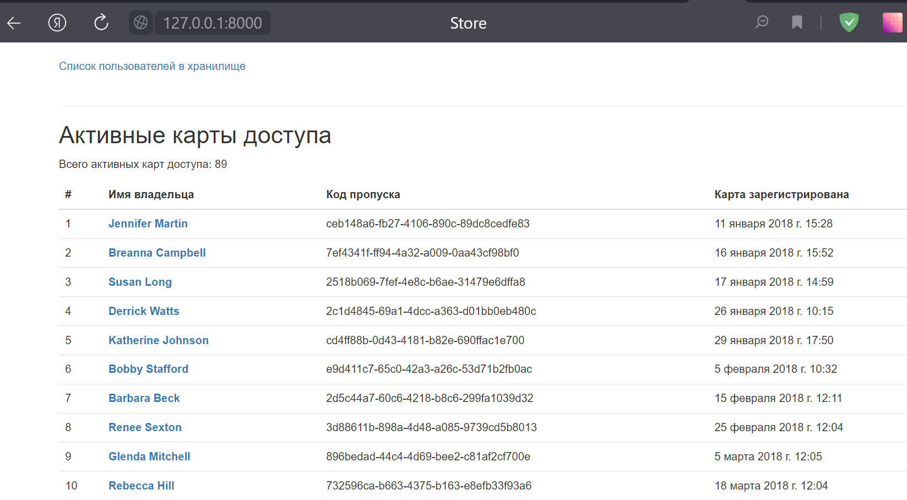

# Пульт охраны банка
Данный скрипт обслуживает пульт охраны банка. Он подключен к БД пропусков всех сотрудников, включая неактивные. Кроме того позволяет отслеживать все посещения хранилища сотрудниками.

## Как установить
Python3 должен быть уже установлен. Затем используйте pip для установки зависимостей:

    pip install -r requirements.txt

### Переменные окружения
Чтобы указать переменные окружения, необходимые для работы, создайте в папке проекта файл `.env`. Его содержимое должно выглядеть так:

    DB_ENGINE=django.db.backends.postgresql_psycopg2
    DB_HOST=checkpoint.host.example
    DB_PORT=1111
    DB_NAME=checkname
    DB_USER=user
    DB_PASSWORD=xxxxx
    SECRET_KEY=SECRET_INFO
    DEBUG=False
    ALLOWED_HOSTS=[127.0.0.1:8000]

где

`ENGINE` - движок для сайта

`HOST` - хост базы данных

`PORT` - порт

`NAME` - имя пользователя

`USER` - никнейм пользователя

`PASSWORD` - пароль пользователя

`DEBUG` - дебаг режим. Включается значением `True`, выключается значением `False`

## Запуск
Запуск осуществляется из командной строки

    python manage.py runserver 0.0.0.0:8000

Затем в браузере нужно ввести адрес `http://127.0.0.1:8000/` и на экране появятся данные с пульт охраны.

### Пример экран с данными пульта охраны:

